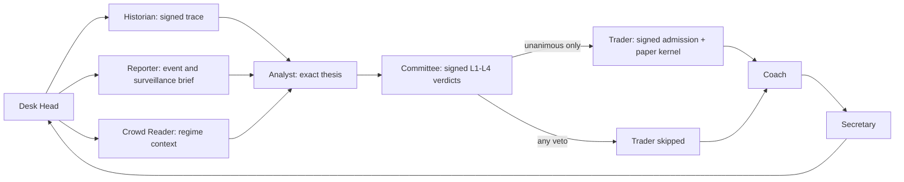

# Governed multi-agent desk runtime

Status: implemented for governed **swing paper trading**. It has no live-capital
gateway and does not turn the intraday replay engine into an MIS executor.

`DeskRuntime.run_cycle(...)` is the Desk Head. It connects the nine roles from
the original PRD to the evidence, risk and execution authorities built in the
platform foundation. Agent prose never becomes an order by itself.

## Which agents are now in use

| PRD role | Runtime implementation | Responsibility in one cycle |
| --- | --- | --- |
| Desk Head | `DeskRuntime` | Orders the workflow, records completed/skipped roles and stops the path on a block, decline or veto |
| Historian | `StrategyHistorian` | Evaluates the immutable Strategy Plan and signs the exact decision trace plus market snapshot |
| Reporter | `EarningsReporter` | Checks the earnings window and verified GSM/ASM status; unknown status fails closed |
| Crowd Reader | `RegimeCrowdReader` | Supplies bounded VIX/breadth regime context; it cannot create a signal |
| Analyst | `GovernedAnalyst` | Writes the thesis around the already-derived quantity, entry, stop, target, horizon and provenance claims; it cannot change them |
| Committee | `ApprovalChainCommittee` | Runs L1 risk, L2 challenge, L3 compliance and L4 sign-off and records a separate signed verdict from every role |
| Trader | `PaperTrader` | Calls governed admission and the durable paper kernel; it cannot accept a raw or unsigned intent |
| Coach | `OutcomeCoach` | Discovers reviewed, reconciled closed episodes from the journal and converts them into scoped, recurrence-gated research hypotheses |
| Secretary | `OperationalSecretary` | Produces read-only daily operational and reconciled-P&L projections |

The existing `ApprovalChain` remains the Committee's decision implementation.
The adapter adds producer authentication around each verdict. The existing
LLM-backed Analyst is not allowed to choose execution numbers; a future LLM
judgment can be injected into `GovernedAnalyst`, but the class always rebuilds
the final thesis from the exact deterministic candidate.

## Runtime path



Every cycle writes `DeskCycleStarted`, one `DeskRoleCompleted` or
`DeskRoleSkipped` event per role, and `DeskCycleCompleted`. The cycle record is
an audit projection, not an execution capability. A completed command replays
from that terminal record without rerunning external roles; its content-addressed
request identity rejects reuse with changed execution facts. Execution still requires all
of these independently verifiable facts:

1. signed decision trace bound to the exact plan and decision-data snapshot;
2. exact plan version at lifecycle stage `paper`;
3. authenticated component heartbeats, reproducible readiness and signed
   operational health;
4. resolvable source claims from the immutable provenance corpus;
5. exact thesis and four independently signed L1-L4 verdicts;
6. signed paper-kernel admission for the exact content-addressed intent;
7. fresh reconciled account truth authenticated by the configured account
   adapter, plus a successful atomic risk reservation.

## Operator visibility

Inspect the most recent cycles without mutating the journal:

```bash
uv run sensei desk-status --journal /absolute/path/to/operations.sqlite3 --limit 10
```

The command refuses a missing journal rather than silently creating an empty
one. Its JSON output shows the result, intent identity, completed roles and
skipped roles for each cycle.

## Safety boundaries

- The runtime is paper-only. `PaperTrader` only accepts `TradingKernel` and the
  kernel package still exposes no live broker gateway.
- A Committee veto never invokes the Trader. Reporter blocks and Analyst
  declines also record downstream roles as skipped.
- The Coach can only create `RESEARCH_ONLY` hypotheses. It cannot veto the next
  trade or edit a Strategy Plan. It automatically discovers only episodes that
  contain close, reconciled attribution and review evidence; incomplete or
  already-learned episodes are skipped and command replay is idempotent.
- Reporter and Crowd Reader context cannot bypass deterministic plan semantics,
  portfolio risk, safety, lifecycle or kernel admission.
- Broker reconciliation requires a content-addressed gateway-signed snapshot.
  Safety reset requires the latest signed clean reconciliation plus a fresh
  owner-signed `safety:reset` authorization.
- RAG, Obsidian and Hermes remain excluded. They are optional future research
  projections and have no place in the authority chain.

## Deployment boundary still open

`GovernedDeskSupervisor` now owns the safe paper-session seam above this
runtime. It refuses a missing or corrupt journal, admits only the exact
`RecordingPaperGateway` type, takes an inode-identity single-writer lease that
also covers hard-link aliases, serializes run/shutdown/close on one object, and
proves that the Kernel, Coordinator, Trader and Desk
share that journal and gateway. It recovers kernel protection before capturing
truth, requires clean authenticated reconciliation, verifies signed Account
Snapshot evidence and signed operational health against a trusted clock,
observes the durable Safety latch, and binds every queued request—including its
bars, market snapshot, quote and evaluation facts—to the captured session
truth. Health, account freshness, runtime binding and safety are checked again
before each cycle. After the Historian-through-Committee chain, the Kernel runs
protect-first recovery and then invokes a Supervisor-owned gate immediately
before entry reservation, command preparation or gateway dispatch. That gate
captures and reconciles fresh truth, records a `DeskSupervisorTruthCaptured`
manifest, and authorizes only the exact intent. Before command preparation,
rejection, invalid evidence or failure before authorization returns durably
quarantines the accepted intent. A previously prepared outbox command remains
incomplete and must pass fresh authorization on every retry; rejection is
preserved rather than masked by an impossible quarantine. The capability is
HMAC-authenticated, bound to the exact intent, cycle request and Account
Snapshot, and durably consumed before reservation. Unscoped kernel recovery is
protective-only and cannot advance an accepted intent.
After every executed cycle, the Supervisor captures fresh
account, broker and health truth and reconciles again before continuing or
recording its terminal result.

Completed command replay does not normally rerun recovery, external roles or
broker work. Halted and failed replay does rerun protective Kernel recovery
before returning the terminal outcome. Production replay resolves every truth
manifest to its signed Account, Health, Broker and reconciliation evidence and
checks that the final manifest matches the terminal report. Safety takes
precedence: if any unrelated Supervisor stream is
incomplete, global kernel recovery and quarantine run before an otherwise
completed replay is returned. Any interrupted supervisor stream is quarantined
on restart, even when the restart uses a different command ID.

The supervisor is a deep paper-session module, not yet a production composition
root. The `compose(...)` callback is a privileged trust boundary because it
executes while the runtime is being assembled; it must not run untrusted code.
The public factory rejects subclasses throughout the side-effecting Kernel,
Coordinator, Trader, Desk, gateway, verifier and safety chain after composition.
This repository still lacks provisioned issuer keys, a production account
adapter, a durable paper gateway, authenticated market/broker truth providers,
a cycle source, alert delivery and a continuously running scheduler. The old launchd jobs still
call the contained legacy commands; they are not silently redirected into this
governed runtime. Production scheduling should be added only after those
adapters exist and the bounded `run_session(...)` seam passes paper-soak and
restart drills. Live and micro-live remain out of scope.
