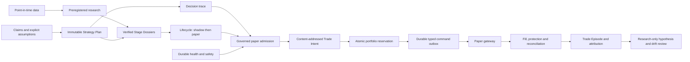

# Trading-platform foundations

Status: implemented and tested foundation for governed shadow and paper trading.
It is not a production deployment, canary executor, or live-capital system.

## Boundary

This foundation turns the prototype into a set of explicit authorities instead
of one large executor. A strategy may describe a trade, but it cannot grant
itself research validity, lifecycle promotion, capital, operational readiness,
or broker access.

The current executable boundary is deliberately narrow:

- canonical daily strategies are long-only and decide from completed bars;
- the intraday engine emits deterministic `SHADOW` or `PAPER` directives only;
- the trading kernel accepts long `BUY` delivery intents and has only a
  `RecordingPaperGateway`;
- lifecycle states include canary and active for governance purposes, but no
  canary or live execution path exists;
- OpenAlgo remains a separate legacy adapter and rejects `off` and `live`
  network execution. It is not a gateway for the governed kernel.

RAG, Obsidian, and Hermes are explicitly outside this implementation. They may
later help a research ingestion workflow, but none may create a Strategy Plan,
issue stage evidence, change a lifecycle state, size a trade, reset safety, or
place an order. The current evidence and execution paths do not depend on them.

## Authority map

| Area | Module | Owns | Does not own |
| --- | --- | --- | --- |
| Point-in-time data | `sensei.research.market_data`, `catalog` | Snapshot identity, membership intervals, lineage and artifact verification | Strategy approval or execution |
| Research examination | `sensei.research.examiner`, `models` | Protocol-bound, fold-level evidence dossiers | Lifecycle promotion |
| Experiment control | `sensei.research.registry` | Preregistration, campaign trial count, locked confirmation access and multiplicity correction | Trading permission |
| Strategy semantics | `sensei.strategy` | Immutable, content-addressed Strategy Plans and deterministic decision traces | Quantity, capital or orders |
| Governance | `sensei.governance.lifecycle`, `evidence` | Exact stage path, authority roles and verified, plan-pinned Stage Dossiers | Broker side effects |
| Durable facts | `sensei.operations.journal` | Event identity, append-only ordering, idempotency, optimistic concurrency and hash-chain verification | Deciding whether a fact is sufficient evidence |
| Operational truth | `sensei.operations.health`, `control_plane` | Durable health and component-readiness assessments | Strategy or risk judgment |
| Paper admission | `sensei.orchestration.paper`, `intents` | Composition of the exact governed plan, trace, health, account snapshot and derived quantity | Gateway dispatch |
| Portfolio authority | `sensei.portfolio_risk` | Atomic reservations, cash/notional/heat/slot limits, loss and drawdown breakers | Alpha decisions or order transport |
| Safety authority | `sensei.portfolio_risk.safety` | Durable global entry latch and owner-controlled reset | Blocking protection or entry cancellation |
| Order state machine | `sensei.kernel` | Typed paper commands, durable outbox, fill/protection ordering and broker reconciliation | Live transport or strategy selection |
| Trade record | `sensei.learning.episodes`, `attribution` | Plan/trace/intent-linked episodes and reconcilable outcome attribution | Automatic strategy mutation |
| Learning and drift | `sensei.learning.outcomes`, `drift` | Recurrence-gated research hypotheses and version-pinned review signals | Trade vetoes or lifecycle changes |
| Intraday session | `sensei.intraday.session` | Exchange event-time state, receipt latency, cutoffs, auctions, feed latch, participation cap and deterministic replay | Broker calls, leverage or live mode |
| Reporting and migration | `sensei.reporting.operations`, `migration.legacy` | Read-only projections and source-preserving historical import | Accounting inference or authorization from legacy records |

## Immutable evidence and execution flow

The `OperationalJournal` is the evidence plane beneath this flow. It uses
SQLite WAL mode with full synchronous writes, global and per-stream hash chains,
content-derived event identities, global idempotency keys, and expected stream
versions. A journal event proves that a fact was durably recorded; the owning
module still decides whether that fact has the required type, lineage, timing,
authority and outcome.

Identity is carried forward instead of reconstructed later:

1. A Strategy Plan ID covers every decision-changing semantic and each field's
   source claim, research assumption, or safety-override authority.
2. The mode-independent engine emits a content-addressed decision trace. An
   actionable trace has exit and risk-budget intent but no quantity.
3. Confirmation evidence comes from a preregistered campaign and a one-use,
   resolver-owned holdout. A caller cannot substitute its own confirmation data.
4. A Stage Dossier pins the exact lineage, plan version, evidence kind and
   supporting journal event IDs. The lifecycle fails closed if any required
   dossier is absent, mismatched, failed, tampered or unverifiable.
5. Paper admission requires that exact plan version at the `paper` stage, a
   durable fresh `HEALTHY` assessment, an unlatched safety control, the exact
   decision trace, quote and reconciled account snapshot.
6. Quantity is derived by `TradeIntentFactory`; it is not accepted from a
   caller. The resulting intent pins plan, trace, market and account identities.
7. Portfolio Risk reserves capacity atomically across held, pending, partially
   filled and not-yet-reconciled exposure. Money and thresholds use integer
   paise or basis points at this boundary.
8. The kernel persists a typed command before dispatch. A positive partial fill
   is protected before another entry can be sent. Unknown, mismatched or
   under-protected broker state causes quarantine and a safety latch.
9. The Trade Episode records immutable planned prices and the complete lineage
   through every fill, reconciled costs, review and close. Attribution rejects a
   caller's arithmetic unless quantity, weighted fill values, currency and fees
   match those durable facts. Outcome learning additionally requires the exact
   closed episode and review evidence. Recurrence can only propose a
   `RESEARCH_ONLY` hypothesis; it cannot veto a trade or mutate a plan.

## Fail-closed behavior

- Missing or stale market, broker or reconciliation truth prevents a healthy
  operational state. A stale active-session feed halts new entries.
- Unknown earnings or exchange surveillance status blocks the legacy approval
  path rather than assuming safety.
- A latched safety control blocks every new entry, while protection and
  entry-cancellation actions remain allowed.
- Risk considers held exposure and all durable reservations together. Filled
  exposure is not freed until a later reconciled account snapshot includes it.
- A broker receipt recorded immediately before a process crash can be replayed;
  the kernel reconstructs the fill and installs missing protection before new
  entries.
- Journal integrity failure makes readiness fail and suppresses trusted P&L
  totals in operational reports.

## Legacy containment

Legacy files and behavior are compatibility inputs, not authorities:

- the old playbook returns no adopted strategies for execution;
- one language-model post-mortem cannot write a global mistake veto;
- the legacy mistake ledger is advisory in summaries and prompts;
- the legacy risk rails reject invalid side, quantity and non-finite prices;
- legacy paper and backtest behavior is long-only, uses worse gap-stop fills,
  and counts holding horizons by exchange sessions;
- legacy migration reads only a caller-supplied manifest, fingerprints source
  bytes and records, marks missing evidence, and imports facts as
  `HISTORICAL_FACT_ONLY` with no lifecycle or trading authority.

The legacy OpenAlgo adapter is sandbox-only and remains outside the governed
kernel. Existing legacy data files are not rewritten by the new platform.

## Current limits and next boundary

The modules are composable and covered by focused tests, but there is not yet a
single deployed runtime that continuously supplies reconciled account truth,
heartbeats, broker snapshots, session events and alert delivery. Intraday
directives are deterministic but are not a live/MIS order path. The only kernel
gateway is an in-memory paper recorder.

Before canary, a completed paper soak must produce plan-pinned paper-trial,
risk-readiness and operations-readiness dossiers, followed by explicit owner
approval. Before any live-capital work, the system still needs a governed live
gateway with broker-native command idempotency, durable broker-side protection,
exit-fill ingestion, continuous reconciliation, production identity and access
control, secrets management, alert delivery, restore drills, an explicitly
bounded canary envelope, and tested rollback/kill procedures. Advancing a
lifecycle record alone does not supply those capabilities.
